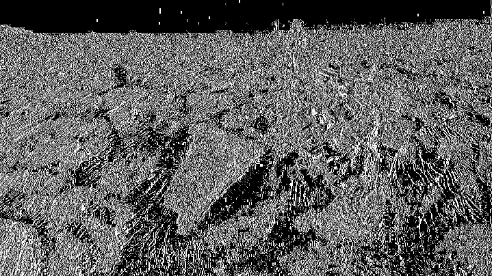

# ICER Image Compression using Wavelet Transformation in Python

Currently, the only available implementation of the ICER progressive wavelet image compression technique as described by NASA is in C. Of course, this is done in C with memory constraints in mind as this algorithm is originally for NASA exploration hardware. However, we'll look at a more modern application friendly version by implementing this technique in Python. The project is based on the paper ["The ICER Progressive Wavelet Image Compressor"](https://ipnpr.jpl.nasa.gov/progress_report/42-155/155J.pdf).

_Note: This is still a work in progress. Here is the task list:_

- [x] Step 1: Wavelet Transformations
  - [x] One-Dimensional Wavelet Transformation
    - [x] Low-pass Filter Implementation
    - [x] High-pass Filter Implementation
  - [x] Two-Dimensional Wavelet Transformation
- [ ] Steps 2: Bit-Plane Coding
- [ ] Step 3: Entropy Coding
- [ ] Step 4: Image Quality and Compression Controlling

## Quick Links

- [How does Wavelet Transformation Work?](https://github.com/dsmith111/ICER-Python/blob/master/ICERPython/Wavelets/README.md)
- [How does Bit-plane Coding Work?](https://github.com/dsmith111/ICER-Python/blob/master/ICERPython/BitPlaneCoding/README.md)

## Installation
Clone the repository:

```bash
Copy code
git clone https://github.com/dsmith111/ICER-Python.git
cd ICER-Python
```

Install the required dependencies:
```bash
Copy code
pip install -r requirements.txt
```
## Usage
The main script for compressing images is compress_image.py. 

### Command Line Arguments

`compress_image.py` accepts the following command line arguments:

- `-i`, `--input_image`: Path to the input image file that you want to compress.
- `-o`, `--output_image`: Prefix for the output image files. The decomposed images will be saved with this prefix and an appropriate suffix, e.g., `_low_pass0.png` and `_high_pass0.png`.
- `-b`, `--bitrate`: (Optional) Bitrate for lossy compression. Default value is `0.5`.
- `-f`, `--filter`: (Optional) Wavelet filter to use for compression. Default value is `"A"`.
- `--filter_parameters`: (Optional) Path to the filter parameters JSON file. Default value is `"./filter_parameters.json"`.

#### Example Usage

To compress an image using the ICER algorithm with the default parameters, run the following command:

```bash
python3 compress_image.py -i path/to/input/image.jpg -o path/to/output/image_prefix -f A
```
This command will perform the wavelet transform on the input image, save the decomposed images as PNG files, and store them in the specified output path with the given prefix.

The decomposed images will have filenames like `image_prefix_low_pass0.png` and `image_prefix_high_pass0.png`.

_Note_: The current implementation only supports grayscale images.

## Project Structure
The project is organized into the following directories:

- `ICERPython`: Contains the main ICER algorithm implementation and the wavelet transform classes.
   - `Wavelets`: Contains the wavelet filter and transform classes, as well as the filters (low-pass and high-pass) used in the wavelet transform.
      - `WaveletFilter.py`
      - `WaveletTransform.py`
      - `Filters`: Contains the low-pass and high-pass filter classes.
         - `HighPassFilters.py`
         - `LowPassFilters.py`
   - `BitPlaneCoding`: Contains the classes and methods related to bit-plane coding.
      - `BitPlaneEncoder.py`: Implements the bit-plane encoding process.
      - `BitPlaneDecoder.py`: Implements the bit-plane decoding process.
      - `ContextModel.py`: Contains the context modeling methods for bit-plane coding.
      - `ProbabilityEstimation.py`: Contains the methods for probability estimation used in the entropy coding process.
   - `ICER.py`: Main ICER implementation, integrating all the components (Wavelets, BitPlaneCoding, etc.).


The main script for compressing images is `compress_image.py`.

## Results
### Wavelet Transformation
The first step in the ICER algorithm is the break down images based on wavelet decomposition. The major note here as to why this is important when compared to other compression algorithms is the full image data compression rather than performing compression region by region. In the event of data transmission failure, most images would simply not have a region of the image; in this case, we are setting up the rest of the algorithm to allow us to send much lower fidelity full images. This allows us to have a better guarantee of receiving a full image with the cost of fidelity incase of any failures.

Here is a comparison of this algorithm's decomposition vs the result's in the paper:

#### Python ICER
**Original Image**


**Decomposed Images**
Horizontal Low-pass, Vertical Low-pass   |  Horizontal Low-pass, Vertical High-pass
:-------------------------:|:-------------------------:
  |  

### NASA ICER
**Original Image**


**Decomposed Images**
Decomposed Images  |  Labels
:-------------------------:|:-------------------------:
  |  

_These images were taken directly from the research paper, hence the lower resolution_

Comparing the Python ICER results against the original NASA ICER results, we can see the decomposition has been accurately implemented.

## Contributing
Contributions are welcome! If you find any issues or have suggestions for improvements, please open an issue or submit a pull request.